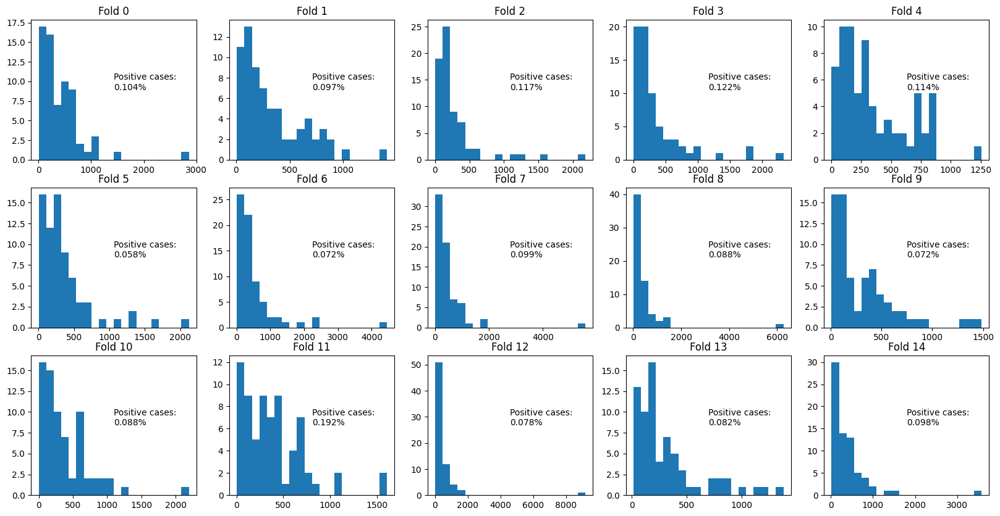

# ISIC2024Kaggle \[[Competition](https://www.kaggle.com/competitions/isic-2024-challenge/overview)]

The repo containing the code I used for the above Kaggle competition.

## Usage

### Setup

Install [required packages](/requirements.txt) using `pip`:

```
pip install -r requirements.txt
```

### Generating Folds

To help training and validation I split the data into 15 subsets. These 15 subsets can be used for 15-, 5-, 3-, or 1-fold cross-validation.
Splitting was conducted in a strategic matter to ensure a reliable validation score. Three factors were considered in creating folds:

1. The portion of positive and negative cases were the same in each fold.
2. There was no leakage on the patient level between folds (ensure each *patient_id* only appears in one fold).
3. There is a rougly equal distribution of number of images/samples per *patient_id* within each of the folds. This
ensures that each fold has roughly the same number of unique *patient_id*s.

#### 1. Run fold generation code

This code will generate a `.json` file indicating which samples belong to which folds. It also produces a plot to show the distribution
of the different folds to ensure the above criteria are met.

The `.json` file is structured as follows:

```
{
    <FOLD_NUMBER> : [ISIC_XX, ISIC_XY, ...],
    ...
}
```

Where `<FOLD_NUMBER>` ranges from 0 to 14 and `ISIC_XX` represents the identifier of a given sample.

```
python melanoma_classifier/data/fold_generator.py
```

You will then find the [`folds.json`](/folds.json) and [`folds.png`](/folds.png) files.


#### 2. Observe output folds

The folds ouput `.png` displays information to validate that the folds were generated successfully.

<div align="center">
  
</div>


We can see that each fold has roughly the same number of positive samples. We also plot a historgram for each
fold showing the number of different images for each *patient_id* in the fold. For example, for the first fold,
we can see that there is one patient with just under 3000 samples.


### Preprocess data

All code for preprocessing the dataset is handled by the trainer and does not need to be run by the user
explicitly. However, here we will cover the steps taken to preprocess the dataset.

#### 0. Combine training and testing datasets

The first thing we must do is combine the train and test datasets by their rows. This ensures that
any preprocessing such as dummy variable creation of numerical value scaling has full informatin
about the possible values in the dataset. If we did not combine the two sets, there could be a case
where the testing data has an unseen class or value causing our pre-processing to fail.

#### 1. Get dummy columns for categorical variables

The first step involves processing categorical variables by creating dummy columns for each of the possible classes.
This is done with the help of `pandas`. This is performed for the `site`, `location`, and `location_simple` columns.

#### 2. Handling sex column

We then map `male` and `female` `sex` values to `1` and `0` integer values, respectively.

#### 3. Missing Values

For any numerical column with missing values we fill this with `-1` so the model can identify this value as unique from the
other possible *real* numerical values.

#### 4. Scaling numerical values

We finally scale all numerical values between the range (0, 1) using a Min-Max scaler.


### Architecture

Here we go over the architecture for the `EfficientNet` model used in this solution.

> There is also code available for an XGBoost model, but this was not completed in time for the competition end date.

The model backbone is an `EfficientNet`. If no meta features are used,
we set the output dim of the network to be `1` for the binary classification
task at hand. If the user decides to use meta features in training, we 
remove the classificaiton head from the `EfficientNet` and use the 
penultimate layer as the image embedding. We create a *meta network*
that runs alongside the `EfficientNet` to obtain *meta feature 
embeddings*. The user is able to specify the size of this network. 
The outputs of the *meta network* and `EfficientNet` features are
concatenated and passed to a final classification layer.


### Training

The model is trained using `Lightning` and `PyTorch` for efficient deployment and definition.

We start with pre-trained `EfficientNet` weights \[[Tan & Le, 2019](https://arxiv.org/abs/1905.11946)] and perform fine-tuning.


Start training using:

```
python trainer.py
```

To change options for training, change the `Config` class in [`trainer.py`](/trainer.py).

> The user can change:
> - version of `EfficientNet` model
> - batch size
> - cutout ratio (depreciated)
> - num workers for dataloader
> - fold (list containing the fold indices used for validation)
> - run name
> - location of run outputs (saved models, configs, etc.)
> - meta features to use in network (list)
> - dimension of meta features network

